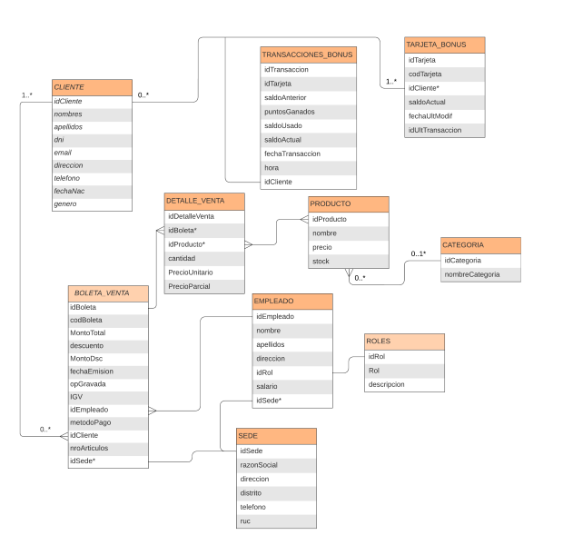

<h1 align="center">Modelo Conceptual y Lógico de un Documento de Compra😊</h1>

## Tarea: 
📍 Crear un modelo conceptual y lógico de un documento de compra de un supermercado: En este caso usaremos el de  Metro.
📍 La idea es identificar **entidades**, **propiedades** y **relaciones**.

## 🔶 Modelo Conceptual 
- CLIENTE (IdCliente, nombres, apellidos, dni, email, telefono, fechaNac, genero)
- PRODUCTO (IdProducto, Nombre, precio, stock, categoria)
- BOLETA_VENTA (idBoleta, idCliente,codigoBoleta, nroArticulos,MontoTotal, descuento,MontoDsc#, fechaEmision, opGravada#,igv#, idEmpleado*, métodoPago)
- DETALLE_DE_VENTA (idDetalleVenta, idBoleta*, idProducto*, cantidad, PrecioUnitario, PrecioParcial)
- TARJETA_BONUS (idTarjeta, codTarjeta, idCliente*, saldoActual, fechaUltMod, idUltTransaccion )
- TRANSACCIONES_BONUS (idTransaccion, idTarjeta*, saldoAnterior, puntosGanados, saldoUsado, SaldoActual, fechaTransaccion, hora)
- SEDE (idSede, RazonSocial, direccion, distrito, telefono, ruc)
- EMPLEADOS (idEmpleado, Nombres, apellidos, direccion, idRol*, salario)
- ROLES (idRol, Rol, descripcion)
- CATEGORIA (idCategoria. nombreCategoria)

## 🔶 Modelo Lógico
Definimos las entidades de nuestro modelo, las relaciones entre todas las entidades y las propiedades de cada uno. Las relaciones pueden verse con las `Llaves foráneas (FK)`. Además, queda claro la referencia entre entidades y en el diagrama ERD (*Entity - Relationship Diagram*) definimos el tipo de relacion `(una a muchas, uno a uno o muchas a muchas)`.

1. **CLIENTE**: 
   - **Propiedades**: 
     - IdCliente **(PK)**: Identificador único del cliente.
     - Nombres: Nombres del cliente.
     - Apellidos: Apellidos del cliente.
     - Dni: Identificador de indentidad legal.
     - Email: Correo electrónico.
     - fechaNac: Fecha de nacimiento.
     - Genero: Sexo.

2. **PRODUCTO**: 
   - **Propiedades**: 
     - IdProducto **(PK)**: Identificador único del producto.
     - Nombre: Nombre del producto.
     - Precio: Precio unitario.
     - Stock: Cantidad disponible en inventario.
     - Categoría: Tipo o categoría del producto.
    
3. **BOLETA_VENTA**: 
   - **Propiedades**:
     - IdBoleta **(PK)**: Identificador único de la boleta.
     - IdCliente **(FK)**: Cliente asociado a la venta.
     - CodigoBoleta: Número generado por default.
     - nroArticulos: Cantidad total de artículos.
     - MontoTotal: Total en soles (S/.).
     - Descuento: 
     - MontoDsc:
     - fechaEmision: 
     - opGravada:
     - igv:
     - métodoPago: 
     - idEmpleado (FK):

4. **DETALLE_VENTA**: 
   - **Propiedades**:
     - idDetalleVenta : Identificador único y secuencial.  
     - idBoleta **(FK)** : Identificador para filtrar el detalle.  
     - idProducto **(FK)**: 
     - cantidad : Integer que representa cantidad.  
     - PrecioUnitario : Sirve mantener registros temporales en caso cambie el precio.  
     - PrecioParcial : Precio unitario x Cantidad. 

5. **TARJETA_BONUS**: 
    - **Propiedades**: 
        - idTarjeta **(PK)**: identificador único.
        - codTarjeta:  Código único mostrado en la tarjeta bonus.
        - idCliente **(FK)**: id del cliente.
        - saldoActual: Saldo que se mostrará al consultar la tarjeta.
        - fechaUltMod : Fecha de la última transacción para verificación.
        - idUltTransaccion **(FK)**: Referencia al registro de las transacciones.

6. **TRANSACCIONES_BONUS**
    - **Propiedades**:
        - idTransaccion **(PK)**: identificador único para las tarjetas bonus.
        - idTarjeta **(FK)** : 
        - saldoAnterior: 
        - puntosGanados: 
        - saldoUsado: Cantidad de puntos usados en caso de canjear.
        - SaldoActual: 
        - fechaTransaccion: Fecha para registro.
        - hora: Hora.

7. **SEDE**
    - **Propiedades**: 
     - idSede **(PK)**: Identificador de cada sede.
     - RazonSocial: Nombre legal de cada sede.
     - direccion: 
     - distrito: 
     - telefono: 
     - ruc: 

8. **EMPLEADOS**
    - **Propiedades**: 
     - idEmpleado **(PK)**: Clave primaria, identificador único.
     - nombres: Datos relevantes para registro
     - apellidos: Apellido completo del empleado.
     - direccion: Se puede considerar un único campo o más campos para más detalle.
     - idRol **(FK)** : Foreign key, de la tabla Roles.
     - salario: campo tipo float. 

9. **ROLES**
    - **Propiedades**: 
     - idRol **(PK)**: Clave primaria, identificador autoincremental.
     - Rol: (Ej. Gerente, cajero, externo, etc...).
     - descripcion: Descripción detallada de funciones.

10. **CATEGORIA** 
    - **Propiedades**: 
    - idCategoria **(PK)**: identificador único.
    - nombreCategoria: categorias de productos


> [!NOTE]  
> Las tablas Roles, Categoria y Sede permite la **normalización** del modelo, para evitar redundancias.

### Diagrama ERD (Diagrama Entidad-Relación)



## 🔶 Modelo Físico 

Para crear el modelo físico se empleará el software [SQL Sever SSMS 2022](https://learn.microsoft.com/es-es/sql/ssms/download-sql-server-management-studio-ssms?view=sql-server-ver16). 

```sql
CREATE TABLE Cliente (
    IdCliente INT PRIMARY KEY IDENTITY(1,1), 
    Nombres VARCHAR(100) NOT NULL,
    Apellidos VARCHAR(100) NOT NULL,
    Dni VARCHAR(8) UNIQUE, 
    Email VARCHAR(100),
    fechaNac DATE,
    Genero VARCHAR(1) --M/F
);
```

```sql
CREATE TABLE Producto (
    IdProducto INT PRIMARY KEY IDENTITY(1,1),
    Nombre VARCHAR(100) NOT NULL,
    Precio DECIMAL(10,2),
    Stock INT,
    Categoria VARCHAR(50)
);
```
```sql
CREATE TABLE BoletaVenta (
    IdBoleta INT PRIMARY KEY IDENTITY(1,1),
    IdCliente INT FOREIGN KEY REFERENCES Cliente(IdCliente),
    CodigoBoleta VARCHAR(30),
    nroArticulos INT,
    MontoTotal DECIMAL(10,2),
    Descuento DECIMAL(10,2),
    MontoDsc DECIMAL(10,2),
    fechaEmision DATE,
    opGravada DECIMAL(10,2),
    igv DECIMAL(10,2),
    metodoPago VARCHAR(50),
    idEmpleado INT FOREIGN KEY REFERENCES Empleados(idEmpleado)
);
```
```sql
CREATE TABLE DetalleVenta (
    idDetalleVenta INT PRIMARY KEY IDENTITY(1,1),
    idBoleta INT FOREIGN KEY REFERENCES BoletaVenta(IdBoleta),
    idProducto INT FOREIGN KEY REFERENCES Producto(IdProducto),
    cantidad INT,
    PrecioUnitario DECIMAL(10,2),
    PrecioParcial AS PrecioUnitario * cantidad
);
```
```sql
CREATE TABLE TarjetaBonus (
    idTarjeta INT PRIMARY KEY IDENTITY(1,1),
    codTarjeta VARCHAR(20) UNIQUE,
    IdCliente INT FOREIGN KEY REFERENCES Cliente(IdCliente),
    saldoActual DECIMAL(10,2),
    fechaUltMod DATE,
    idUltTransaccion INT FOREIGN KEY REFERENCES Transaccion(idTransaccion)
);
```
```sql
CREATE TABLE TransaccionesBonus (
    idTransaccion INT PRIMARY KEY IDENTITY(1,1),
    idTarjeta INT FOREIGN KEY REFERENCES TarjetaBonus(idTarjeta),
    saldoAnterior DECIMAL(10,2),
    puntosGanados INT,
    saldoUsado INT,
    SaldoActual DECIMAL(10,2),
    fechaTransaccion DATE,
    hora TIME
);
```
```sql
CREATE TABLE Sede (
    idSede INT PRIMARY KEY IDENTITY(1,1),
    RazonSocial VARCHAR(100),
    direccion VARCHAR(255),
    distrito VARCHAR(50),
    telefono VARCHAR(9),
    ruc VARCHAR(20) UNIQUE
);
```
```sql
CREATE TABLE Empleados (
    idEmpleado INT PRIMARY KEY IDENTITY(1,1),
    nombres VARCHAR(50),
    apellidos VARCHAR(50),
    direccion VARCHAR(255),
    idRol INT FOREIGN KEY REFERENCES Roles(idRol),
    salario DECIMAL(10,2)
);
```
```sql
CREATE TABLE Roles (
    idRol INT PRIMARY KEY IDENTITY(1,1),
    Rol VARCHAR(50),
    descripcion VARCHAR(200)
);
```

```sql
CREATE TABLE Categoria (
    idCategoria INT PRIMARY KEY IDENTITY(1,1),
    nombreCategoria VARCHAR(100)
);
```

## ✍️ Autor
<div style="background-image: url('../../imgs/background.jpg'); background-size: cover; padding: 20px; text-align: center; border-radius: 10px;">
    <a href="https://github.com/DDR2AS" style="text-decoration: none; color: black; display: inline-block; text-align: center;">
        
        <h1 style="margin: 10px 0 0; font-size: 1.5em; color: black; font-weight: bold;">Diego Avila</h1>
    </a>
    <br />
    <a href="https://linkedin.com/in/diego-avila-as/" title="LinkedIn"></a>
    <a href="mailto:diego.avila12394@gmail.com" title="Email"></a>

</div>
